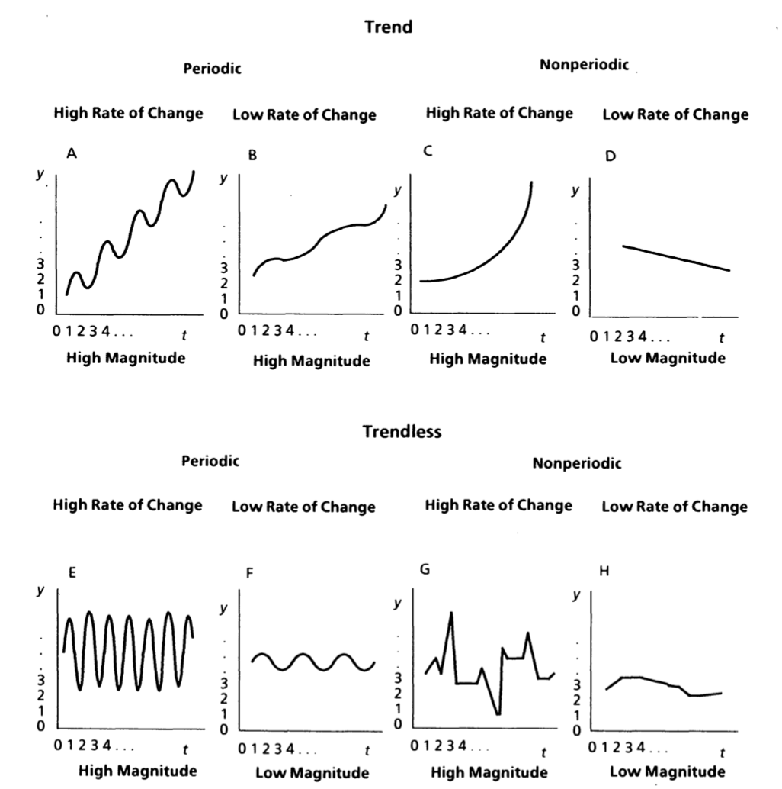

# Systems Theory Principles

We start with principles from systems theory -- a gentle place to begin given that some of the terms will overlap with the growth modeling literature.

## Stocks and Flows

One common approach to explaining how things happen over time is to identify stocks and flows. @meadows2008thinking defines both with the following:

> A stock is a store, a quantity, an accumulation of material or information that has built up over time. It may be the water in a bathtub, a population, the books in a bookstore, the wood in a tree, the money in a bank, your own self confidence. A stock does not have to be physical. Your reserve of good will toward others or your supply of hope that the world can be better are both stocks. 

> Stocks change over time through the actions of flows. Flows are filling and draining, births and deaths, purchases and sales, growth and decay, deposits and withdrawals, successes and failures. A stock, then, is the present memory of the history of changing flows within the system (18).

\noindent That last sentence is what makes a stock imply behavior over time. We speak about stocks by both referring to what they contain right now but also how they have developed and where they are likely to go. Also note that stocks do not have to change.

The behavior of a stock -- whether it rises, falls, or remains the same -- depends on the nature of flows. We can learn about stock behavior by subtracting outflows from inflows. Doing so leads to three general principles about stocks. They will [@cronin2009don]: (1) rise when inflows exceed outflows, (2) fall when outflows exceed inflows, and (3) remain the same when inflows equal outflows. In other words, stocks change with respect to the summative properties of their flows. Stocks also set the pace for the cumulative rhythm of the system. Even when flows are changing rapidly, the stock may change slowly because accumulation occurred over a long period of time. 

Figure \ref{stocks} plots a simple stock and flow system over 20 time periods. 

\begin{center}

---------------

Insert Figure \ref{stocks} Here

---------------

\end{center}


```{r, echo = F, fig.cap = 'the ol stock system\\label{stocks}'}
set.seed(4)

time <- 20
into <- 5
outof <- 5
df_mat <- matrix(, ncol = 4, nrow = time)
count <- 0

for(i in 1:time){
  count <- count + 1
  
  if(i == 1){
    
    df_mat[count, 1] <- i
    df_mat[count, 2] <- 5
    df_mat[count, 3] <- 5
    df_mat[count, 4] <- df_mat[count, 2] - df_mat[count, 3]
  }else if (i < 11){
    
  df_mat[count, 1] <- i
  df_mat[count, 2] <- into + (i * 0.5)
  df_mat[count, 3] <- outof
  df_mat[count, 4] <- df_mat[count, 2] - df_mat[count, 3]

        
  }else{
    
  df_mat[count, 1] <- i
  df_mat[count, 2] <- into
  df_mat[count, 3] <- outof + (i * 0.3)
  df_mat[count, 4] <- df_mat[count, 2] - df_mat[count, 3]
    
  }

  
}

df <- data.frame(df_mat)
names(df) <- c('Time', 'Inflow', 'Outflow', 'Stock')
library(tidyverse)

df <- df %>%
  gather(Inflow, Outflow, Stock, key = 'Variable', value = 'Value')

library(ggplot2)
plot1 <- ggplot(df, aes(x = Time, y = Value, group = Variable)) + 
  geom_point(aes(shape = Variable), color = 'black', size = 3) +
  geom_point(aes(shape = Variable), color= 'white', size = 1) + 
  geom_line(aes(linetype = Variable)) + 
  theme_classic() + 
  scale_linetype_manual(values = c('twodash', 'dotted', 'solid')) + 
  scale_size_manual(values = c(2, 3, ))


plot1

```

\noindent Beginning at the first time point, inflows are equal to outflows and the stock therefore sits at zero. Over the first ten time points, however, outflows remain the same whereas inflows increase. With inflows exceeding outflows the stock also increases up until time point ten. At this time, inflows drop back down to five whereas outflows increase -- leading to a large reduction in the stock. As outflows continue to rise over time -- with no counterbalancing movement from the inflow -- the stock ultimately decreases. 

Systems theory uses stocks and flows as general labels for each of the things in the system. Above, we described the behavior of the stocks and flows with simple terms -- increasing, decreasing, or constant. Systems theory also provides a more systematic way of describing trajectories and explaining behavior over time. These are unpacked in an excellent paper by Monge (1990), and the framework includes trend, magnitude, rate of change, and periodicity. These are shown respectively in figure \ref{monge}. 

```{r, echo = F, fig.cap = 'monge image\\label{monge}', fig.height = 9, fig.width= 8}
library(png)
library(grid)

img <- readPNG("figs/fig_monge1.png")
grid.raster(img)

#

```

\begin{center}

---------------

Insert Figure \ref{monge} Here

---------------

\end{center}


## Trend

Dividing figure \ref{monge} into two portions -- the top and bottom -- reveals differences in trend. All of the panels on the top of the figure have trend, whereas those on the bottom do not. Trend is the systematic increase or decrease of a variable over time. 

## Magnitude

Magnitude is the level, value, or amount of the variable at each time point -- the number on the $y$ axis at each respective point in time. For example, in panel *C* of figure two the magnitude is low at times 1, 2, and 3, but is high at later points in time. Additionally, panel *E* and *F* have the same magnitude if we average their values over time, but panel *E* contains both high and low magnitude, whereas the magnitude for the trajectory in panel *F* remains relatively constant.

## Rate of Change

Monge (1990) refers to rate of change as "How fast the magnitude increases or decreases per one unit of time." Panels *G* and *H* reveal differences in rates of change. 

## Periodicity

Periodicity is the amount of time before a pattern repeats itself, and it is equivalent to the term cycle. The most important piece about periodicity is that it must be couched with "controlling for trend." Notice that panel *A* is periodic because, after controlling for trend, there are repeated patterns over time.

## Two Variables

It is of course possible to combine these notions when researchers are studying processes with more than one variable. For example, a researcher might describe the magnitude in their presumed dependent variable with respect to the magnitude of their independent variable, or the rates of change across the system of variables. When we turn to the behavior and relationships among two or more variables -- i.e., a system of variables -- a few additional principles are available. 

## Lags

How long does it take for the presumed independent variable to produce an effect on the outcome? This is the notion of lag.

## Permanence

Once the effect happens, how long does it last? That is, if the independent variable causes the dependent variable to change to a new value, does the dependent value remain at that new value indefinitely?

## Feedback Loops

Systems theory researchers often convey process by using feedback loops. Feedback loops describe processes where a variable eventually relates back to itself.

There are two common ways to describe the behavior of a focal variable within a feedback loop. When feedback causes the variable to move in the opposite direction than it initially moved, this is known as negative feedback, deviation counteraction, or a balancing feedback loop [@monge_theoretical_1990; @meadows2008thinking]. Here, an initial increase in $x$ leads to subsequent changes in the system that, through time, eventually cause $x$ to decrease. Now that $x$ has gone down, more changes happen in the system that, through time, eventually cause $x$ to increase. 

When feedback, instead, causes the variable to move in the same direction that it initially moved, this is known as postive feedback, deviation ampliciation, or a reinforcing feedback loop [@monge_theoretical_1990; @meadows2008thinking]. Here, changes in $x$ in one direction lead to eventual changes in $x$ in the same direction and thus produce exponential, explosive, or amplifying behavior. Of course, we can also identify whether there is positive or negative feedback for every variable in the system.

## Examples

People from our literature using these terms and principles to explain something. Study 1 measured X and Y and described trend. Study 2 measured X and Y and talked about cycles. Study 3 measured X and Y and reported lags. 

## Summary

These systems theory notions are valuable tools to explain and describe process. Note that we did not cover everything to keep the reading concise and consistent. For example, @monge also covers discontinuous systems, so please refer to his excellent paper for an even deeper discussion. Now we turn to mathematics and dynamics and describe principles from these domains that are used to explain or describe process.

