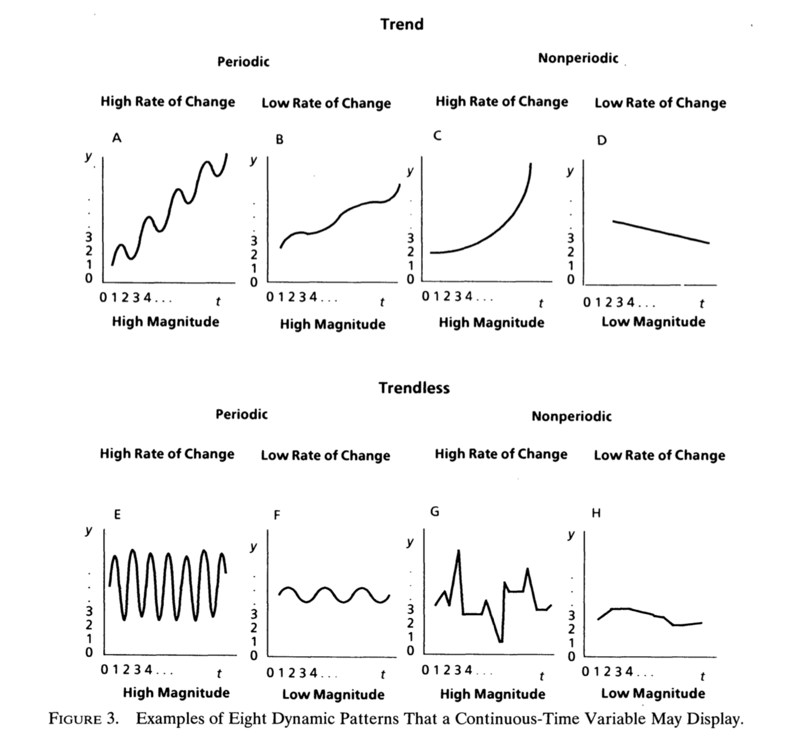

```{r setup, include=FALSE}
knitr::opts_chunk$set(echo = TRUE, warning = F, message = F)
```

# Systems Theory Principles

* stocks and flows
* now imagine those lines on a graph over time
* how do we describe those lines over time?
* then get into the math that describes those lines
  + but first, feedback. super prevalent in systems and complexity literature.

## Stocks and Flows

One common approach to explaining how things happen over time is to identify stocks and flows. Meadows [@meadows2009] defines both with the following:

> A stock is a store, a quantity, an accumulation of material or information that has built up over time. It may be the water in a bathtub, a population, the books in a bookstore, the wood in a tree, the money in a bank, your own self confidence. A stock does not have to be physical. Your reserve of good will toward others or your supply of hope that the world can be better are both stocks. 

> Stocks change over time through the actions of flows. Flows are filling and draining, births and deaths, purchases and sales, growth and decay, deposits and withdrawals, successes and failures. A stock, then, is the present memory of the history of changing flows within the system (18).

\noindent That last sentence is what makes a stock imply behavior over time. We speak about stocks both by referring to what they contain right now but also how they have developed and where they are likely to go. Also note that stocks do not have to change.

Many organizational phenomena can be viewed as combinations of stocks and flows. Stocks: Affect [@sonnentag], helping behaviors, depletion, number of customers, justice perceptions, work-family conflict. Flows: turnover, stressful events, goal assignments. Sometimes the same thing can be expressed as both a stock and a flow, depending on how the researcher abstracts the situation. For example, the number of work tasks could be a stock, where it increases when we are given more assignments and decreases when we finish them. Or it could be a flow that leads into something like stress. 

The behavior of a stock -- whether it rises, falls, or remains the same -- depends on the nature of flows. We can learn about stock behavior by subtracting outflows from inflows. Doing so leads to three general principles about stocks. They will [@cronin2008]:

1. rise when inflows exceed outflows
2. fall when outflows exceed inflows
3. remain the same when inflows equal outflows.

\noindent In other words, stocks change with respect to the summative properties of their flows. Stocks also set the pace for the dynamics of the system. Even when flows are changing rapidly, the stock may change slowly because accumulation occurred over a long period of time. 

## Transition to Monge

Now imagine stock and flow behavior on a time series plot over time. How do we describe the patterns we see over time? We have identified stocks and flows, we have labeled them, now we want to describe the trajectories to help us explain the process. Look to monge.

Monge 1990 provides an excellent framework for describing trajectories. These include trend, magnitude, rate of change, and periodicity and are shown in the figure below.



## Trend


The long term increase or decrease in the magnitude of a variable. Can be a positive or negative value. 
There is an upward trend of two units each time the variable occurs. 


## Continuity

Does the variable have a consistent nonzero value through time? Zero represents the nonexistence of the variable. A continuous time variable, such as organizational climate, is typically viewed as one that always exists at some value (Joyce and Slocum, 1984). A discontinous-time variable, such as the payment of the monthly bonus in the Scanlon managagement process, is one that occurs, then does not have a value until it occurs again at the next month (Monge & Cozzens, 1987).

## Magnitude

The amount of the variable at each time point. Can be negative if the scale allows for it.
Magnitude is eight units.

## Rate of Change

How fast the magnitude increases or decreases per one unit of time. 


## Periodicity; Cycles; Oscillations

The amount of time that transpires between the regular repeating of the values of the variable, controlling for trend. These are essentially cycles. 
Something happens every six time points. 

### Duration

The length of time that a variable exists at some nonzero value (primarily for discontinuous time variables). How long a variable "lasts for."
Duration of two time units. 

### Summary

In discontinous systems, rates of change are instant (think of a bar plot...the left line is an instant spike up to a value of 8). In continuous systems, rates of change would be "two units per time period."
He also gets into a typology of causes and effects for a two state system: history, lag, rate of change, magnitude of change, and permanence of change (duration). These essentially overlap with what was discussed above, the difference is that you focus on them as a function of something else. X has a two unit change in magnitude that lasts for three time units (duration), and four time units later (lag) Y has a two unit change in magnitude that lasts for ten time units (duration). 