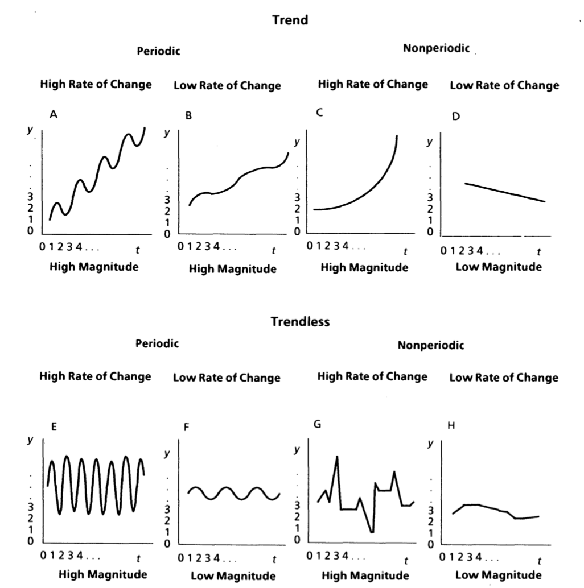
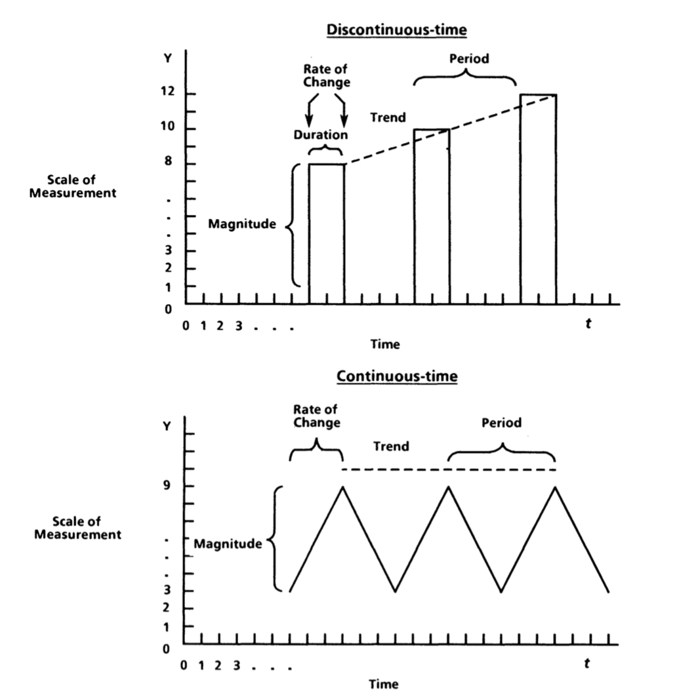

```{r setup, include=FALSE}
knitr::opts_chunk$set(echo = TRUE, warning = F, message = F)
```

when I finished writing last time I was thinking about how to make this a "number of variables" sectioned paper. One variable over time: multiple variables over time and their influence

# Systems Theory Principles

* stocks and flows
* now imagine those lines on a graph over time
* how do we describe those lines over time?
* then get into the math that describes those lines
  + but first, feedback. super prevalent in systems and complexity literature.

## Stocks and Flows

One common approach to explaining how things happen over time is to identify stocks and flows. Meadows [@meadows2009] defines both with the following:

> A stock is a store, a quantity, an accumulation of material or information that has built up over time. It may be the water in a bathtub, a population, the books in a bookstore, the wood in a tree, the money in a bank, your own self confidence. A stock does not have to be physical. Your reserve of good will toward others or your supply of hope that the world can be better are both stocks. 

> Stocks change over time through the actions of flows. Flows are filling and draining, births and deaths, purchases and sales, growth and decay, deposits and withdrawals, successes and failures. A stock, then, is the present memory of the history of changing flows within the system (18).

\noindent That last sentence is what makes a stock imply behavior over time. We speak about stocks both by referring to what they contain right now but also how they have developed and where they are likely to go. Also note that stocks do not have to change.

Many organizational phenomena can be viewed as combinations of stocks and flows. Stocks: Affect [@sonnentag], helping behaviors, depletion, number of customers, justice perceptions, work-family conflict. Flows: turnover, stressful events, goal assignments. Sometimes the same thing can be expressed as both a stock and a flow, depending on how the researcher abstracts the situation. For example, the number of work tasks could be a stock, where it increases when we are given more assignments and decreases when we finish them. Or it could be a flow that leads into something like stress. 

The behavior of a stock -- whether it rises, falls, or remains the same -- depends on the nature of flows. We can learn about stock behavior by subtracting outflows from inflows. Doing so leads to three general principles about stocks. They will [@cronin2008]:

1. rise when inflows exceed outflows
2. fall when outflows exceed inflows
3. remain the same when inflows equal outflows.

\noindent In other words, stocks change with respect to the summative properties of their flows. Stocks also set the pace for the dynamics of the system. Even when flows are changing rapidly, the stock may change slowly because accumulation occurred over a long period of time. 

Figure 1 plots a simple stock and flow system over 20 time periods. 

```{r, echo = F}
set.seed(4)

time <- 20
into <- 5
outof <- 5
df_mat <- matrix(, ncol = 4, nrow = time)
count <- 0

for(i in 1:time){
  count <- count + 1
  
  if(i == 1){
    
    df_mat[count, 1] <- i
    df_mat[count, 2] <- 5
    df_mat[count, 3] <- 5
    df_mat[count, 4] <- df_mat[count, 2] - df_mat[count, 3]
  }else if (i < 11){
    
  df_mat[count, 1] <- i
  df_mat[count, 2] <- into + (i * 0.5)
  df_mat[count, 3] <- outof
  df_mat[count, 4] <- df_mat[count, 2] - df_mat[count, 3]

        
  }else{
    
  df_mat[count, 1] <- i
  df_mat[count, 2] <- into
  df_mat[count, 3] <- outof + (i * 0.3)
  df_mat[count, 4] <- df_mat[count, 2] - df_mat[count, 3]
    
  }

  
}

df <- data.frame(df_mat)
names(df) <- c('Time', 'Inflow', 'Outflow', 'Stock')
library(tidyverse)

df <- df %>%
  gather(Inflow, Outflow, Stock, key = 'Variable', value = 'Value')

library(ggplot2)
plot1 <- ggplot(df, aes(x = Time, y = Value, color = Variable)) + 
  geom_point() + 
  geom_line()

plot1

```

\noindent Beginning at time zero, inflows are equal to outflows and the stock therefore sits at zero. Over the first ten time points, however, outflows remain the same whereas inflows increase. With inflows exceeding outflows the stock also increases up until time point ten. At this time, inflows drop back down to five whereas outflows increase -- leading to a large reduction in the stock. As outflows continue to rise over time with no counterbalancing movement from the inflow, the stock ultimately decreases. 

### Transition to Monge

Systems theory uses stocks and flows as general labels for each of the things in the system. Above, we described the behavior of the stocks and flows with simple terms -- increasing, decreasing, or constant. Systems theory also provides a more systematic way of describing trajectories and explaining behavior over time. These are unpacked in an excellent paper by Monge 1990, and the framework includes trend, magnitude, rate of change, and periodicity. Each of these is shown respectively in figure two. 






## Trend

Dividing figure two into two portions -- the top and bottom -- reveals differences in trend. All of the panels on the top of figure two have trend, whereas those on the bottom do not. Trend is the systematic increase or decrease of a variable over time. People might say things like, "there is an \{upward, positive, increasing} trend in variable $x$ over time."


The long term increase or decrease in the magnitude of a variable. Can be a positive or negative value. 
There is an upward trend of two units each time the variable occurs. 


## Magnitude

Magnitude is the level, value, or amount of the variable at each time point -- the number on the $y$ axis at each respective point in time. For example, in panel *C* of figure two the magnitude is low at times 1, 2, and 3, but is high at later points in time. Additionally, panel *E* and *F* have the same magnitude if we average their values over time, but panel *E* contains both high and low magnitude, whereas the magnitude for the trajectory in panel *F* remains relatively constant.

NOTICE THAT MY EXPLANATION IS DIFFERENT FROM HIS LABELS -- WHICH I DON'T LIKE. Figure 3 shows a more systematic depiction but I don't think it is as useful; people won't get it right away.


## Rate of Change

Monge refers to rate of change as "How fast the magnitude increases or decreases per one unit of time." Keep in mind this is a different notion from how "change" is used in the growth modeling statistical literature. Panels *G* and *H* reveal differences in rates of change. 

## Periodicity; Cycles; Oscillations

Periodicity is the amount of time before a pattern repeats itself, and it is equivalent to terms like cycles or oscillations. The most important piece about periodicity is that it must be couched with "controlling for trend." Notice that panel *A* is periodic because, after controlling for trend, there are repeated patterns over time. People would use phrases like "something happens every six time points."

## Feedback loops - not sure where to put this. Maybe nowhere

## Equilibrium

could do this with two variables

## Summary

These terms describe trajectory behavior over time for each variable in the system. 

great paper; go read about it
duration; how to talk about things that relate to one another like lags.
how two things influence one another


the behavior of the trajectories of each variable in the system over time. 


The amount of time that transpires between the regular repeating of the values of the variable, controlling for trend. These are essentially cycles. 
Something happens every six time points. 


The amount of the variable at each time point. Can be negative if the scale allows for it.
Magnitude is eight units.


## Continuity

Does the variable have a consistent nonzero value through time? Zero represents the nonexistence of the variable. A continuous time variable, such as organizational climate, is typically viewed as one that always exists at some value (Joyce and Slocum, 1984). A discontinous-time variable, such as the payment of the monthly bonus in the Scanlon managagement process, is one that occurs, then does not have a value until it occurs again at the next month (Monge & Cozzens, 1987).


## Periodicity; Cycles; Oscillations

The amount of time that transpires between the regular repeating of the values of the variable, controlling for trend. These are essentially cycles. 
Something happens every six time points. 

### Duration

The length of time that a variable exists at some nonzero value (primarily for discontinuous time variables). How long a variable "lasts for."
Duration of two time units. 

### Summary

In discontinous systems, rates of change are instant (think of a bar plot...the left line is an instant spike up to a value of 8). In continuous systems, rates of change would be "two units per time period."
He also gets into a typology of causes and effects for a two state system: history, lag, rate of change, magnitude of change, and permanence of change (duration). These essentially overlap with what was discussed above, the difference is that you focus on them as a function of something else. X has a two unit change in magnitude that lasts for three time units (duration), and four time units later (lag) Y has a two unit change in magnitude that lasts for ten time units (duration). 